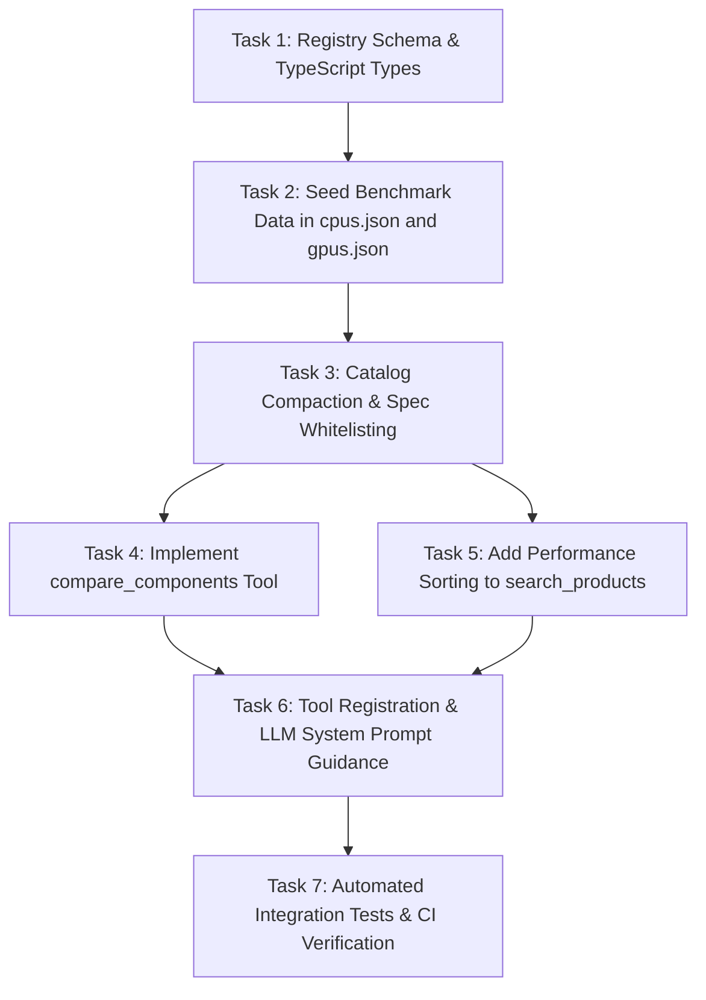

# Implementation Plan: Component Benchmarks & Relative Performance Ranks

> **Status:** Specification & Planning Phase — **Implementation has not started.**  
> **Author / Architect:** Manish Modak & Pair AI  
> **Target PR:** Draft / Architecture Spec  

---

## 1. Executive Summary & Problem Statement

LLMs evaluating PC components are constrained by training knowledge cutoffs. When evaluating newer components (e.g., NVIDIA RTX 50-series, AMD Ryzen 9000-series, Intel Core Ultra 200) or comparing parts across differing architecture generations, models frequently hallucinate relative performance tiers, misjudge bottleneck risks, or struggle to calculate price-to-performance tradeoffs.

This plan specifies a deterministic, local-first benchmark ranking subsystem integrated into PCBuildSage. It provides:
1. **Curated relative performance indices** in the offline component registry (`data/registry/`).
2. **Passive enrichment & optional performance sorting** in the existing `search_products` tool.
3. **A dedicated `compare_components` tool** for side-by-side delta and price-to-performance calculations.
4. **Strict missing-data and research guards**: benchmarks are optional; missing data returns `unset`/`unavailable` and **never blocks** recommendations or validation.

---

## 2. Agreed Design Decisions

| Decision Area | Agreed Choice | Rationale |
| :--- | :--- | :--- |
| **Scoring Scale** | Relative performance index with fixed baseline = 100 (scores can exceed 100). | Intuitive, linear, and matches established hardware aggregation hierarchies (TechPowerUp, Tom's Hardware). |
| **GPU Baseline** | `NVIDIA GeForce RTX 4060 8GB` = 100. | Modern, ubiquitous, mid-range 1080p/1440p anchor. |
| **CPU Baseline** | `AMD Ryzen 5 7600` = 100. | Modern, ubiquitous, 6-core AM5 gaming/productivity anchor. |
| **Metric Separation** | GPUs by resolution (`p1080`, `p1440`, `p2160`); CPUs by workload (`gaming`, `multicore`, `single_core`). | Prevents deceptive cross-workload conflation (e.g., high core count does not equal high FPS). |
| **Provenance** | Every benchmark record includes `baseline`, `source`, and `benchmark_date`. | Enforces transparency, accountability, and reproducible data provenance. |
| **Missing Data** | Return `unset` / `unavailable`. Never hallucinate or synthesize estimated numbers. | Preserves absolute trust in the system's output. |
| **Research Budget** | Missing benchmarks alone **do not** trigger web research. Targeted research only for unresolved critical decisions. | Prevents latency spikes, rate limit exhaustion, and unnecessary token spend. |
| **Tool Surface** | **Hybrid**: Passive `perf_score` + optional `sort_by: "perf"` in `search_products`; new dedicated `compare_components` tool. | Gives instant context during search, and detailed arithmetic during explicit comparisons. |
| **Build Validation** | **Deferred**: CPU/GPU balance advice is non-blocking and deferred until workload-specific, evidence-backed rules exist. | Avoids ungrounded heuristics or comparing CPU and GPU scores directly. |

---

## 3. Scope & Non-Goals

### In Scope
- Schema additions to `data/schemas/registry.schema.json`.
- Seed benchmark data in `data/registry/gpus.json` and `data/registry/cpus.json` for major recent generations (RTX 30/40/50, RX 6000/7000, Ryzen 5000/7000/9000, Intel 12th/13th/14th/Core Ultra).
- Propagating benchmark metrics through `src/lib/catalog/compact.ts` into `FUNCTIONAL_SPEC_KEYS`.
- Adding optional `sort_by: "perf"` with mandatory resolution/workload context to `search_products`.
- Creating `src/lib/tools/compare-components.ts` and registering it in `src/lib/tools/index.ts`.
- Value ratio (performance per unit price) computation when both catalog prices and comparable benchmarks exist.
- Unit and integration tests covering schema validation, tool execution, and edge-case handling.

### Non-Goals
- **No automatic web research for missing benchmarks**: missing benchmarks will not trigger background crawls or external API calls.
- **No synthetic benchmarking or simulation engine**: PCBuildSage will not calculate theoretical FLOPS, clock math, or simulated FPS.
- **No CPU/GPU cross-index math**: CPU and GPU performance indices will never be compared directly against each other.
- **No blocking of unbenchmarked parts**: parts lacking benchmark scores remain 100% purchasable, searchable, and valid for builds.

---

## 4. Proposed Contracts & Schemas

### 4.1. Registry Schema (`data/schemas/registry.schema.json`)

```json
{
  "benchmarks": {
    "type": "object",
    "description": "Normalized relative performance index with fixed baseline = 100.",
    "required": ["baseline", "source", "benchmark_date", "scores"],
    "additionalProperties": false,
    "properties": {
      "baseline": {
        "type": "string",
        "minLength": 1,
        "description": "Reference component name defining the 100-point anchor (e.g. 'NVIDIA GeForce RTX 4060 8GB' or 'AMD Ryzen 5 7600')."
      },
      "source": {
        "type": "string",
        "minLength": 1,
        "description": "Identifier or URL of the benchmark suite or review methodology (e.g. 'TechPowerUp Relative Performance 2026' or 'Tom's Hardware GPU Hierarchy')."
      },
      "benchmark_date": {
        "type": "string",
        "description": "ISO 8601 date when the benchmark index was compiled."
      },
      "scores": {
        "type": "object",
        "additionalProperties": false,
        "properties": {
          "p1080": { "type": "number", "minimum": 0, "description": "1080p Ultra raster gaming index relative to baseline." },
          "p1440": { "type": "number", "minimum": 0, "description": "1440p Ultra raster gaming index relative to baseline." },
          "p2160": { "type": "number", "minimum": 0, "description": "4K (2160p) Ultra raster gaming index relative to baseline." },
          "gaming": { "type": "number", "minimum": 0, "description": "CPU 1080p gaming performance index relative to baseline." },
          "multicore": { "type": "number", "minimum": 0, "description": "CPU multi-threaded productivity index (Cinebench / Blender) relative to baseline." },
          "single_core": { "type": "number", "minimum": 0, "description": "CPU single-thread index relative to baseline." }
        }
      }
    }
  }
}
```

### 4.2. Compact Spec Whitelist (`src/lib/catalog/compact.ts`)

Add benchmark fields to `FUNCTIONAL_SPEC_KEYS`:
- `perf_score` (context-aware primary score: 1440p for GPUs, gaming for CPUs)
- `benchmarks` (the full baseline + scores object for rich downstream tools)

### 4.3. `search_products` Tool Contract Updates

#### Input Schema additions:
```ts
sort_by: z
  .enum(["price", "name", "retailer", "last_scraped", "perf"])
  .default("price")
  .describe("Sort field. Use 'perf' to rank by performance (requires 'resolution' for GPUs or 'workload' for CPUs)."),
resolution: z
  .enum(["1080p", "1440p", "4k"])
  .optional()
  .describe("Target resolution context when sorting GPUs by performance."),
workload: z
  .enum(["gaming", "multicore", "single_core"])
  .optional()
  .describe("Target workload context when sorting CPUs by performance.")
```

#### Output behavior when `sort_by === "perf"`:
1. Validates that `category` is `"gpu"` or `"cpu"`, and matching `resolution`/`workload` is provided.
2. Sorts items with comparable benchmark scores descending (`order === "desc"`) or ascending (`order === "asc"`).
3. Items lacking benchmark scores are **not filtered out**; they are placed after all scored items.
4. Response metadata includes:
   ```json
   {
     "benchmark_coverage": {
       "scored": 6,
       "unscored": 2,
       "metric": "p1440",
       "baseline": "NVIDIA GeForce RTX 4060 8GB"
     }
   }
   ```

### 4.4. `compare_components` Tool Contract

#### Input Schema:
```ts
export const compareComponentsInputSchema = z.object({
  parts: z
    .array(z.string())
    .min(2)
    .max(4)
    .describe("2 to 4 component names or registry keys to compare (e.g. ['RTX 4070 Super', 'RTX 5070'] or ['Ryzen 5 7600', 'Ryzen 7 7800X3D'])."),
  category: z
    .enum(["cpu", "gpu"])
    .describe("Component category to compare. Comparisons must belong to the same category."),
  resolution: z
    .enum(["1080p", "1440p", "4k", "all"])
    .optional()
    .describe("For GPUs: specific resolution context. Defaults to 'all'."),
  workload: z
    .enum(["gaming", "multicore", "single_core", "all"])
    .optional()
    .describe("For CPUs: specific workload context. Defaults to 'all'.")
});
```

#### Output Schema:
```ts
export interface ComponentComparisonResult {
  category: "cpu" | "gpu";
  baseline: string;
  source?: string;
  benchmark_date?: string;
  components: Array<{
    name: string;
    registry_key?: string;
    specs: Record<string, unknown>;
    scores: Record<string, number | null>;
    price: number | null;
    currency?: string;
    retailer?: string;
    in_stock?: boolean;
    value_ratio?: number | null; // (score / price) * 1000 for standard readability
  }>;
  comparisons: Array<{
    metric: string;
    leader: string;
    relative_deltas: Array<{
      component: string;
      delta_pct_vs_leader: number | null; // e.g. -15.2%
    }>;
  }>;
  value_summary?: {
    metric: string;
    best_value?: string;
    note?: string;
  };
  warnings: string[]; // e.g. ["'RTX 5060' has no verified benchmark data; returned unset without web research."]
}
```

---

## 5. Missing-Data & Research Boundaries

1. **Deterministic Resolution Only**:  
   `compare_components` resolves parts against `data/registry/` and active catalog products. It does not invoke search crawlers.
2. **Strict Non-Blocking Rule**:  
   If a component is unbenchmarked:
   - `scores[metric] = null`
   - `warnings.push("Benchmark score for <part> is unavailable.")`
   - The tool succeeds and returns comparative data for the remaining parts.
3. **No Cross-Baseline Comparison**:  
   If two parts have benchmark scores from differing baselines or incompatible test suites, delta calculations return `null` with an explanatory notice: `"Cannot compute direct delta: differing baseline references."`
4. **Value Ratios**:  
   Calculated strictly when both `score !== null` and `price > 0`. Never estimated against MSRP or foreign currencies.

---

## 6. Affected Files & Architecture Map

```
pcbuildsage/
├── data/
│   ├── schemas/
│   │   └── registry.schema.json              # [MODIFY] Add 'benchmarks' schema definition
│   └── registry/
│       ├── gpus.json                         # [MODIFY] Seed benchmark scores for major GPUs
│       └── cpus.json                         # [MODIFY] Seed benchmark scores for major CPUs
├── src/
│   ├── lib/
│   │   ├── catalog/
│   │   │   ├── compact.ts                    # [MODIFY] Add perf keys to FUNCTIONAL_SPEC_KEYS
│   │   │   ├── repository.ts                 # [MODIFY] Support perf sort in searchProducts
│   │   │   └── sql-repository.ts             # [MODIFY] SQL ordering with NULLS LAST for perf
│   │   └── tools/
│   │       ├── search-products.ts            # [MODIFY] Expose 'perf' in sort_by & coverage meta
│   │       ├── compare-components.ts         # [NEW] Dedicated comparison tool implementation
│   │       └── index.ts                      # [MODIFY] Register compare_components tool
│   └── types/
│       └── registry.ts                       # [MODIFY] TypeScript interface for ComponentBenchmarks
└── tests/
    ├── tools/
    │   ├── compare-components.test.ts        # [NEW] Unit tests for comparison & delta arithmetic
    │   └── search-products-perf.test.ts      # [NEW] Tests for perf sorting & fallback behavior
    └── data/
        └── registry-schema.test.ts           # [VERIFY] Verify validate:data passes schema checks
```

---

## 7. Phased Implementation Tasks & Dependencies



### Phase 1: Data Contracts & Seeding
- [ ] **Task 1: Schema Updates**
  - Update `data/schemas/registry.schema.json` with the `benchmarks` schema.
  - Update `src/types/registry.ts` with `ComponentBenchmarks` type definitions.
- [ ] **Task 2: Seed Benchmarks**
  - Seed baseline = 100 for `NVIDIA GeForce RTX 4060 8GB` (`gpus.json`) and `AMD Ryzen 5 7600` (`cpus.json`).
  - Populate verified relative scores for common modern GPUs (RTX 40/50-series, RX 7000-series) and CPUs (Ryzen 7000/9000, Intel 13th/14th Gen).
  - Run `npm run validate:data` to verify zero schema regressions.

### Phase 2: Catalog Integration & Comparison Engine
- [ ] **Task 3: Catalog Spec Propagation**
  - Update `src/lib/catalog/compact.ts` to include `benchmarks` and `perf_score`.
- [ ] **Task 4: `compare_components` Tool**
  - Implement `src/lib/tools/compare-components.ts` with strict delta math, value ratios, and missing-data guards.
  - Add comprehensive unit tests in `tests/tools/compare-components.test.ts`.

### Phase 3: Search Sorting & LLM Prompting
- [ ] **Task 5: `search_products` Performance Sort**
  - Update `searchProductsInputSchema` to accept `sort_by: "perf"` with `resolution` or `workload`.
  - Update SQLite / memory sorting to order scored parts first, followed by unscored parts, with coverage diagnostics.
- [ ] **Task 6: Registration & LLM Directives**
  - Register `compare_components` in `src/lib/tools/index.ts`.
  - Update `src/lib/llm/chat-engine.ts` system directives advising the LLM on when to use `compare_components` vs `search_products`.

### Phase 4: Verification & Hardening
- [ ] **Task 7: Comprehensive Verification**
  - Full test suite execution: `npm test` and `npm run typecheck`.
  - Edge case validation: unbenchmarked components, missing prices, identical models, single-component requests.

---

## 8. Acceptance Criteria

1. **Data Validity**:
   - `npm run validate:data` passes without any schema validation errors.
2. **Missing-Data Resilience**:
   - Querying or comparing parts with missing benchmark data returns `null` / `unavailable` and **never** throws an exception or halts conversation.
   - Missing benchmarks never prevent a part from being selected or validated in `validate_build`.
3. **Accuracy of Calculations**:
   - `compare_components` deltas accurately reflect mathematical percentage differences relative to the leader.
   - Value ratios are only computed when both catalog price and benchmark score are present and non-zero.
4. **Performance Sorting Integrity**:
   - `search_products` with `sort_by: "perf"` sorts highest performing parts first, places unbenchmarked parts at the bottom, and indicates coverage in the metadata.
5. **Zero Web Bloat**:
   - No benchmark comparison initiates network requests or web search unless explicitly requested through the separate `consult` workflow.

---

## 9. Unresolved Decisions & Future Work

- **CPU/GPU Bottleneck & Balance Heuristics**:
  - *Status:* **Deferred.**
  - Direct mathematical comparison between CPU and GPU scores was rejected as ungrounded.
  - Future implementation may introduce an advisory rule in `validate_build` only when evidence-backed, resolution-specific pairing matrices (e.g. minimum CPU gaming index recommended for tier of GPU at 1080p vs 4K) are compiled from empirical reviews.
