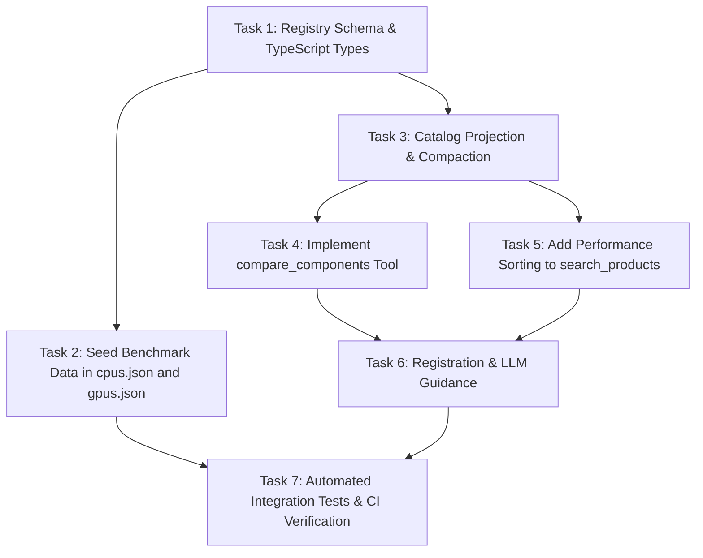

# Implementation Plan: Component Benchmarks & Relative Performance Ranks

> **Status:** Specification & Planning Phase — **Implementation has not started.**  
> **Author / Architect:** Manish Modak & Pair AI  
> **Target PR:** Draft / Architecture Spec  

---

## 1. Executive Summary & Problem Statement

LLMs evaluating PC components are constrained by training knowledge cutoffs. When evaluating newer components (e.g., NVIDIA RTX 50-series, AMD Ryzen 9000-series, Intel Core Ultra 200) or comparing parts across differing architecture generations, models frequently hallucinate relative performance tiers, misjudge bottleneck risks, or struggle to calculate price-to-performance tradeoffs.

This plan specifies a deterministic, local-first benchmark ranking subsystem integrated into PCBuildSage. It provides:
1. **Curated relative performance indices** in the offline component registry (`data/registry/`).
2. **Passive enrichment & optional performance sorting** in the existing `search_products` tool.
3. **A dedicated `compare_components` tool** for side-by-side delta and price-to-performance calculations after narrowing the eligible options to 3–5 finalists.
4. **Strict missing-data and research guards**: benchmarks are optional; missing data returns `unset`/`unavailable` and **never blocks** recommendations or validation.

---

## 2. Agreed Design Decisions

| Decision Area | Agreed Choice | Rationale |
| :--- | :--- | :--- |
| **Scoring Scale** | Relative performance index with fixed baseline = 100 (scores can exceed 100). | Intuitive, linear, and matches established hardware aggregation hierarchies (TechPowerUp, Tom's Hardware). |
| **GPU Baseline** | `NVIDIA GeForce RTX 4060 8GB` = 100. | Modern, ubiquitous, mid-range 1080p/1440p anchor. |
| **CPU Baseline** | `AMD Ryzen 5 7600` = 100. | Modern, ubiquitous, 6-core AM5 gaming/productivity anchor. |
| **Metric Separation** | GPUs by resolution (`p1080`, `p1440`, `p2160`); CPUs by workload (`gaming`, `multicore`, `single_core`). | Prevents deceptive cross-workload conflation (e.g., high core count does not equal high FPS). |
| **Provenance** | Each metric includes `baseline`, `dataset_id`, `source`, and `benchmark_date`. | A fixed baseline alone does not establish comparability; datasets identify a frozen suite, settings, and test methodology. |
| **Missing Data** | Return `unset` / `unavailable`. Never hallucinate or synthesize estimated numbers. | Preserves absolute trust in the system's output. |
| **Shortlist Before Comparison** | Discover eligible options with compact search results, finalize 3–5 candidates in a category, then compare that shortlist together. Two candidates are sufficient when only two are relevant. | Focuses detailed benchmark retrieval on actual finalists without fixed comparison-call quotas. |
| **Tool Surface** | **Hybrid**: Passive `perf_score` + optional `sort_by: "perf"` in `search_products`; new dedicated `compare_components` tool. | Gives instant context during search, and detailed arithmetic during explicit comparisons. |
| **Build Validation** | **Deferred**: CPU/GPU balance advice is non-blocking and deferred until workload-specific, evidence-backed rules exist. | Avoids ungrounded heuristics or comparing CPU and GPU scores directly. |

---

## 3. Scope & Non-Goals

### In Scope
- Schema additions to `data/schemas/registry.schema.json`.
- Seed a small verified set in `data/registry/gpus.json` and `data/registry/cpus.json`; extend generation coverage incrementally as comparable sources become available.
- Propagating benchmark metrics through `src/lib/catalog/compact.ts` into `FUNCTIONAL_SPEC_KEYS`.
- Adding optional `sort_by: "perf"` with mandatory resolution/workload context to `search_products`.
- Creating `src/lib/tools/compare-components.ts` and registering it in `src/lib/tools/index.ts`.
- Value ratio (performance per unit price) computation when both catalog prices and comparable benchmarks exist.
- Unit and integration tests covering schema validation, tool execution, and edge-case handling.

### Non-Goals
- **No automatic web research for missing benchmarks**: missing benchmarks will not trigger background crawls or external API calls.
- **No synthetic benchmarking or simulation engine**: PCBuildSage will not calculate theoretical FLOPS, clock math, or simulated FPS.
- **No CPU/GPU cross-index math**: CPU and GPU performance indices will never be compared directly against each other.
- **No benchmark-based exclusion**: missing scores do not affect search eligibility or build validity; normal stock, compatibility, and user constraints still apply.

---

## 4. Proposed Contracts & Schemas

### 4.1. Registry Schema (`data/schemas/registry.schema.json`)

The optional `benchmarks` property maps category-appropriate metrics to records. A missing metric is omitted in the registry and returned as `null` by tools. Use these logical types to implement the JSON schema in the existing registry schema structure:

```ts
type GpuMetric = "p1080" | "p1440" | "p2160";
type CpuMetric = "gaming" | "multicore" | "single_core";
interface BenchmarkMetric {
  score: number; // finite, strictly positive; baseline is 100
  baseline: string; // canonical registry key for the reference component
  dataset_id: string; // immutable comparison group, including metric/methodology revision
  source: string; // exact source URL or versioned source artifact
  benchmark_date: string; // YYYY-MM-DD: source measurement/publication date
}
type GpuBenchmarks = Partial<Record<GpuMetric, BenchmarkMetric>>;
type CpuBenchmarks = Partial<Record<CpuMetric, BenchmarkMetric>>;
```

Schema validation rejects wrong-category metric keys, non-positive scores, unknown record properties, and malformed dates. A present benchmark map must contain at least one metric. Keep `benchmarks` optional so existing registry entries remain valid.

Each dataset must document its suite/version, aggregation and normalization formula, test platform, settings, and reference measurement. GPU indices describe raster gaming at the named resolution; CPU gaming, multicore, and single-core indices each identify a specific suite. Cinebench and Blender results cannot be interchanged under one generic metric. Calculate `100 * measured_result / baseline_result` only for higher-is-better measurements within the same dataset; unsupported measurement types remain unset.

Two scores are comparable only when category, metric, baseline, and `dataset_id` match. Matching publisher names, baseline names, or dates alone is insufficient. Changing suite composition or methodology creates a new dataset; retain provenance per metric. Start with one curated active dataset per category/metric, documented alongside seed data. Search uses that dataset consistently; do not combine unrelated review indices to fill coverage gaps.

### 4.2. Compact Spec Whitelist (`src/lib/catalog/compact.ts`)

- `perf_score`: selected context's score, or null when unavailable.
- `perf_metric`: the selected metric, returned alongside the score.
- `perf_provenance`: baseline, dataset ID, source, and benchmark date for that score.

When search supplies resolution/workload, use that context even if sorting by price. For ordinary searches without context, omit performance enrichment rather than silently selecting 1440p/gaming. Comparison reads full metric records from the registry directly; ordinary search does not need to return the entire benchmark map for every product. Whitelisting alone does not derive these fields: explicitly project them from the resolved registry record before compaction.

### 4.3. `search_products` Tool Contract Updates

#### Input Schema additions:
```ts
sort_by: z
  .enum(["price", "name", "retailer", "last_scraped", "perf"])
  .default("price")
  .describe("Sort field. Use 'perf' to rank by performance (requires 'resolution' for GPUs or 'workload' for CPUs)."),
resolution: z
  .enum(["1080p", "1440p", "4k"])
  .optional()
  .describe("Target resolution context when sorting GPUs by performance."),
workload: z
  .enum(["gaming", "multicore", "single_core"])
  .optional()
  .describe("Target workload context when sorting CPUs by performance.")
```

#### Output behavior when `sort_by === "perf"`:
1. Validates that `category` is `"gpu"` or `"cpu"`, and matching `resolution`/`workload` is provided.
2. Sorts comparable scores descending by default for `perf`; honor an explicit `asc`. Keep existing defaults for other sorts. Use a stable product-ID tie-breaker.
3. Items lacking a score in the active comparison dataset are **not filtered out**; place them after comparable scored items in either direction. Treat incompatible datasets as unscored for ranking, with a diagnostic.
4. Response metadata includes:
   ```json
   {
     "benchmark_coverage": {
       "scored": 6,
       "unscored": 2,
       "metric": "p1440",
       "baseline": "<canonical RTX 4060 registry key>",
       "dataset_id": "<active p1440 dataset>",
       "scope": "all_matching_products_before_limit"
     }
   }
   ```

Coverage counts apply to the full eligible result set after market, stock, price, and spec filters, before limiting results. Unscored products remain eligible but may fall outside the returned page; the LLM must not describe the top scored result as definitively fastest when coverage is incomplete.

**Repository execution path:** benchmark scores currently come from registry resolution after SQL retrieval. The current scan may stop at `limit + 1` matches, so sorting that shortlist is incorrect. For the initial implementation, retain the existing path for non-performance sorts. For `perf`, scan all SQL-filtered candidates in batches, resolve specs and apply registry filters, project comparable scores, sort globally, then apply the result limit. Calculate coverage from that same eligible set. Do not add an SQL score sort unless scores are actually materialized there. Measure this path with the current catalog; a materialized score index is future optimization if needed. Test a highest-scoring match located beyond the first SQL batch.

### 4.4. `compare_components` Tool Contract

#### Input Schema:
```ts
export const compareComponentsInputSchema = z.object({
  parts: z
    .array(z.string())
    .min(2)
    .max(5)
    .describe("2 to 5 distinct shortlisted component names or registry keys to compare (e.g. ['RTX 4070 Super', 'RTX 5070'] or ['Ryzen 5 7600', 'Ryzen 7 7800X3D'])."),
  category: z
    .enum(["cpu", "gpu"])
    .describe("Component category to compare. Comparisons must belong to the same category."),
  resolution: z
    .enum(["1080p", "1440p", "4k", "all"])
    .optional()
    .describe("For GPUs: required resolution; all only when explicitly requested by the user."),
  workload: z
    .enum(["gaming", "multicore", "single_core", "all"])
    .optional()
    .describe("For CPUs: required workload; all only when explicitly requested by the user.")
});
```

Validate the category-matching context and reject the wrong category's context. There is no implicit `all` default. Resolve aliases deterministically, then reject duplicate canonical keys. Ambiguous names return candidate identities without guessing a SKU. Unknown names return an unavailable component entry. Missing benchmark data is a successful result, not a retry signal.

#### Output Schema:
```ts
export interface ComponentComparisonResult {
  category: "cpu" | "gpu";
  components: Array<{
    name: string;
    registry_key: string | null;
    metrics: Record<string, {
      benchmark: BenchmarkMetric | null;
      value_ratio: number | null; // (score / price) * 1000, for this metric
    }>;
    offer: {
      product_id: string;
      price: number;
      currency: string;
      retailer: string;
      last_scraped: string;
    } | null;
  }>;
  comparisons: Array<{
    metric: string;
    dataset_id: string | null;
    leader: string | null;
    relative_deltas: Array<{
      component: string;
      delta_pct_vs_leader: number | null;
    }>;
    best_value: string | null;
  }>;
  warnings: string[];
}
```

Return only requested metrics. `delta_pct_vs_leader = 100 * (score / leader_score - 1)`; this expresses how far a part falls below the leader, not how much faster the leader is relative to that part. Pick leaders and best value only within the active comparable group; require at least two eligible components, otherwise return null. Preserve each metric's provenance even when comparison is unavailable. Retain precision for calculations and round only output values.

Select the lowest positive-priced, in-stock catalog offer for the exact resolved part in the active country/currency, breaking ties by newest scrape then product ID. Do not substitute a similar model, MSRP, or foreign-market offer. Return the offer identity, price and scrape time used. Value results require at least two comparable benchmarks with eligible same-currency offers; other entries remain null. Calculate and identify best value separately for each metric. A missing offer never blocks performance comparison.

---

## 5. Missing-Data & Research Boundaries

1. **Deterministic Resolution Only**:  
   `compare_components` resolves parts against `data/registry/` and active catalog products. It does not invoke search crawlers.
2. **Strict Non-Blocking Rule**:  
   If a component is unbenchmarked:
   - `metrics[metric].benchmark = null`
   - `warnings.push("Benchmark score for <part> is unavailable.")`
   - The tool succeeds and returns comparative data for the remaining parts.
3. **No Cross-Baseline Comparison**:  
   If two parts have benchmark scores from differing baselines or incompatible test suites, delta calculations return `null` with an explanatory notice identifying the actual baseline or dataset mismatch.
4. **Value Ratios**:  
   Follow the per-metric, comparable-group and offer-selection rules in §4.4. Never estimate prices from MSRP or foreign currencies.

### 5.1. Discover, shortlist, then compare

1. **Discover eligible options:** use `search_products` to identify candidates matching the user's budget, availability, compatibility constraints, and intended workload. Use compact specs and optional contextual performance scores to narrow the field. Discovery does not mean enumerating every catalog product or fetching detailed benchmarks for every search result.
2. **Finalize a shortlist:** select 3–5 distinct candidates within the category being decided, with a clear reason each remains competitive. Deduplicate retailer listings for the same part. Do not pad the shortlist when only two relevant options exist; when one option already satisfies the decision, skip comparison. Missing benchmark data alone must not disqualify an otherwise suitable finalist.
3. **Compare the finalists together:** send the complete shortlist to `compare_components` in one batch for the relevant workload/resolution. The tool resolves detailed benchmark records only for those supplied parts. Do not run pairwise comparisons across the catalog, or compare every intermediate search batch.
4. **Choose and reuse:** use the batch result to make the recommendation. Reuse available results in follow-up discussion. Revisit the shortlist when the user's requirements, availability, prices, or a material unresolved tradeoff change the decision; do not keep rotating candidates for marginal gains after the choice is supported.

There are no fixed per-request comparison or benchmark-research call quotas, persistent budget counters, or budget-exhaustion responses in this feature. The tool schema enforces a maximum of five distinct candidates per batch; tool descriptions and chat guidance direct the intended workflow, verified with representative conversation evaluations. The batch-size check alone does not guarantee the model follows the workflow.

Benchmarks remain optional enrichment. Search returns compact context, not full benchmark records for all products. Optional server-side performance sorting may examine local scores across eligible matches to rank correctly, but that does not expose every product's detailed benchmarks to the LLM or invoke comparison/research.

Targeted research through `consult` remains optional, when enabled and explicitly requested or necessary to resolve a material uncertainty about a finalist. Missing benchmarks alone do not trigger it. Do not research the entire candidate pool to complete benchmark coverage. Existing compatibility/specification research behavior remains unchanged.

---

## 6. Affected Files & Architecture Map

```
pcbuildsage/
├── data/
│   ├── schemas/
│       └── registry.schema.json              # [MODIFY] Add 'benchmarks' schema definition
│   └── registry/
│       ├── gpus.json                         # [MODIFY] Seed benchmark scores for major GPUs
│       └── cpus.json                         # [MODIFY] Seed benchmark scores for major CPUs
├── src/
│   └── lib/
│       ├── catalog/
│       │   ├── compact.ts                    # [MODIFY] Add perf keys to FUNCTIONAL_SPEC_KEYS
│       │   ├── repository.ts                 # [MODIFY] Support perf sort in searchProducts
│       │   └── sql-repository.ts             # [MODIFY] Global registry-aware perf ranking before limit
│       ├── registry.ts                       # [MODIFY] Existing registry types and benchmark records
│       ├── llm/chat-engine.ts                # [MODIFY] Discover, shortlist, compare directives
│       └── tools/
│           ├── search-products.ts            # [MODIFY] Expose 'perf' in sort_by & coverage meta
│           ├── compare-components.ts         # [NEW] Dedicated comparison tool implementation
│           └── index.ts                      # [MODIFY] Register compare_components tool
└── tests/                                   # Proposed tests; align with existing colocated conventions
    ├── tools/
    │   ├── compare-components.test.ts        # [NEW] Unit tests for comparison & delta arithmetic
    │   └── search-products-perf.test.ts      # [NEW] Tests for perf sorting & fallback behavior
    └── data/
        └── registry-schema.test.ts           # [VERIFY] Verify validate:data passes schema checks
```

---

## 7. Phased Implementation Tasks & Dependencies



The existing registry type file is `src/lib/registry.ts`. Shortlist selection guidance belongs in tool descriptions and `src/lib/llm/chat-engine.ts`; this feature does not require new request-budget persistence.

### Phase 1: Data Contracts & Seeding
- [ ] **Task 1: Schema Updates**
  - Update `data/schemas/registry.schema.json` with the `benchmarks` schema.
  - Update `src/lib/registry.ts` with per-metric benchmark types.
  - Define shared score projection, comparison-group selection, and 2–5-candidate batch contracts.
- [ ] **Task 2: Seed Benchmarks**
  - Document immutable dataset definitions and normalization inputs. Start with a small verified set; broader generation coverage is incremental and not a prerequisite for tool development.
  - Seed baseline = 100 for `NVIDIA GeForce RTX 4060 8GB` (`gpus.json`) and `AMD Ryzen 5 7600` (`cpus.json`).
  - Populate verified relative scores for common modern GPUs (RTX 40/50-series, RX 7000-series) and CPUs (Ryzen 7000/9000, Intel 13th/14th Gen).
  - Run `npm run validate:data` to verify zero schema regressions.

### Phase 2: Catalog Integration & Comparison Engine
- [ ] **Task 3: Catalog Spec Propagation**
  - Project `perf_score`, `perf_metric`, and selected provenance from resolved registry metrics; add those keys to compaction. Leave no-context search unchanged.
- [ ] **Task 4: `compare_components` Tool**
  - Implement `src/lib/tools/compare-components.ts` with strict delta math, value ratios, and missing-data guards.
  - Add comprehensive unit tests in `tests/tools/compare-components.test.ts`.

### Phase 3: Search Sorting & LLM Prompting
- [ ] **Task 5: `search_products` Performance Sort**
  - Update `searchProductsInputSchema` to accept `sort_by: "perf"` with `resolution` or `workload`.
  - Implement global registry-aware ranking before limiting as specified in §4.3, with full eligible-set coverage and existing non-performance sort behavior preserved.
- [ ] **Task 6: Registration & LLM Directives**
  - Register `compare_components` in `src/lib/tools/index.ts`.
  - Update `src/lib/llm/chat-engine.ts` and tool descriptions with the discover → shortlist → batch comparison workflow in §5.1. Detailed benchmark retrieval is for finalists only; comparison remains optional.

Tasks 2 and 3 can proceed independently after Task 1 contracts are agreed, using fixtures. Tasks 4 and 5 can proceed in parallel after Task 3; Task 6 integrates both. Verification includes real seed data from Task 2. Contributors should own separate modules and coordinate shared contract changes through Task 1.

### Phase 4: Verification & Hardening
- [ ] **Task 7: Comprehensive Verification**
  - Full test suite execution: `npm test` and `npm run typecheck`.
  - Edge case validation: unbenchmarked components, missing prices, duplicate canonical models, single-component requests, and successful batches of 3, 4, and 5 candidates.
  - Evaluate representative chat traces for shortlist-first behavior, compact discovery payloads, optional comparison, and relevant follow-up changes.

---

## 8. Acceptance Criteria

1. **Data Validity**:
   - `npm run validate:data` passes without any schema validation errors.
2. **Missing-Data Resilience**:
   - Querying or comparing parts with missing benchmark data returns `null` / `unavailable` and **never** throws an exception or halts conversation.
   - Missing benchmarks never prevent a part from being selected or validated in `validate_build`.
3. **Accuracy of Calculations**:
   - `compare_components` deltas accurately reflect mathematical percentage differences relative to the leader.
   - Value ratios are only computed when both catalog price and benchmark score are present and non-zero.
4. **Performance Sorting Integrity**:
   - `search_products` with `sort_by: "perf"` sorts highest performing parts first, places unbenchmarked parts at the bottom, and indicates coverage in the metadata.
5. **Comparable Data and Context**:
   - Same-baseline but different-dataset scores never participate in shared ranking/deltas/value winners.
   - Search scores identify the requested metric; missing context never silently selects a different workload. Comparison requires context, and `all` is explicit.
   - Each returned metric retains its own provenance; value ratios are metric-specific and use eligible same-currency catalog offers.
6. **Shortlist-First Tool Use**:
   - Discovery returns compact specs/context rather than detailed benchmark maps for every result.
   - Representative build conversations narrow eligible options to 3–5 distinct finalists per relevant category before one batch comparison; two viable options need no padding and one clear option needs no comparison.
   - The comparison tool accepts 3-, 4-, and 5-part batches, rejects more than five or duplicate canonical parts, and reads detailed benchmarks only for supplied finalists.
   - Chat evaluations cover avoiding comparisons of every search batch, exhaustive pairwise comparisons, and research of the entire pool. Follow-ups reuse results unless relevant inputs or the decision change.
   - Missing data never blocks a recommendation or initiates research by itself. No fixed call quotas or budget-state machinery are introduced.
7. **Global Ranking**:
   - A best-scoring candidate beyond the first SQL batch still ranks first before limit; both explicit sort directions put unscored entries last.
   - Coverage describes all eligible matches, including unreturned unscored entries. Existing non-performance search behavior remains intact.
8. **Zero Web Bloat**:
   - No benchmark comparison initiates network requests or web search unless explicitly requested through the separate `consult` workflow.

---

## 9. Unresolved Decisions & Future Work

- **CPU/GPU Bottleneck & Balance Heuristics**:
  - *Status:* **Deferred.**
  - Direct mathematical comparison between CPU and GPU scores was rejected as ungrounded.
  - Future implementation may introduce an advisory rule in `validate_build` only when evidence-backed, resolution-specific pairing matrices (e.g. minimum CPU gaming index recommended for tier of GPU at 1080p vs 4K) are compiled from empirical reviews.

- **Implementation checkpoints (not permission to omit requirements):**
  - Choose the initial source suites and verify reference coverage before seeding; do not invent scores to meet generation targets.
  - Assess full-candidate performance sorting against the current catalog size. Add materialization only if measured cost warrants it.
